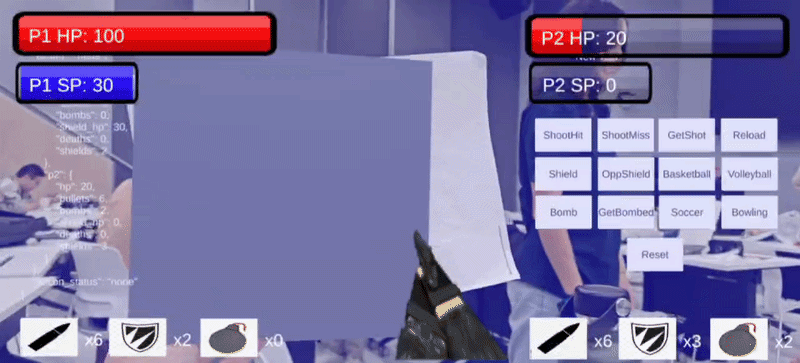

# Hi, I'm Jorelle

Product manager who ships. I take AI products from user problem to working code, and I care about the boring parts that make them hold up in production.
Computer Engineering (BEng) and Management (MSc) at NUS. Former Associate PM at Workato. National fencer for Singapore. 

## Featured work

### Liaison: knowledge-graph language learning app

**Problem:** Language apps optimize for streaks, not mastery. I hit that wall teaching myself French and wanted a tool that engineers real difficulty. 
**Approach:** Vocabulary, grammar, phonology, morphology and pragmatics live in a Neo4j graph with prerequisite edges. Each learner has a per-node proficiency and spaced-repetition (FSRS) state. An LLM builds lessons and exercises just in time from the graph, and every interaction updates it. Cost fix: a bank of pre-generated, reviewed exercises for common nodes, with on-demand generation only for custom lessons or gaps.   
**Result:** [Devpost submission](https://devpost.com/software/liaison-oqkfgv)

  

### LLM recommendation engine (Workato)

**Problem:** Users could not find relevant content in a large knowledge archive. 
**Approach:** Recommendations generated from user profile and stated role. Weekly batch generation, with fallback to the previous run if a batch fails. 
**Result:** 40% lift in content engagement across product surfaces

### AR laser tag (NUS CG4002 capstone)

**Problem:** Make an embedded laser tag system feel like a game, not a lab demo. 
**Approach:** Built the AR visualizer subsystem that renders game state live. 
**Result:** 

  
   
  <i>Testing footage of AR visualizer connected with hardware sensors</i>

